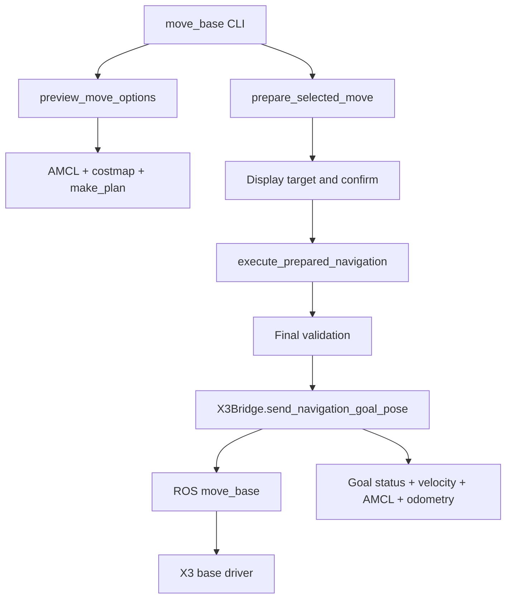

# Architecture

## Runtime

- Yahboom ROSMASTER X3 mecanum base
- Jetson TX2 NX, Ubuntu 18.04.6
- ROS1 Melodic with AMCL, costmaps, TF, and `move_base`
- Robonix Python 3.10 environment
- rosbridge and `roslibpy` between Robonix and ROS1

## Request flow

## Components

`jetson/main.py` implements the Robonix capabilities. It creates preview
sessions, validates targets, issues one-time tokens, and controls the final
publish path.

`jetson/x3_bridge.py` reads ROS state through rosbridge, publishes one
`PoseStamped` goal, tracks the resulting goal ID, and cancels that goal on a
timeout or watchdog event. It does not publish `/cmd_vel`.

`jetson/scripts/move_base_cli.py` handles candidate selection, target display,
operator confirmation, result output, and cancellation.

Coordinates and thresholds remain in the provider. The CLI can select an
option but cannot replace its coordinates or relax the checks. ROS `move_base`
is the expected `/cmd_vel` publisher.
