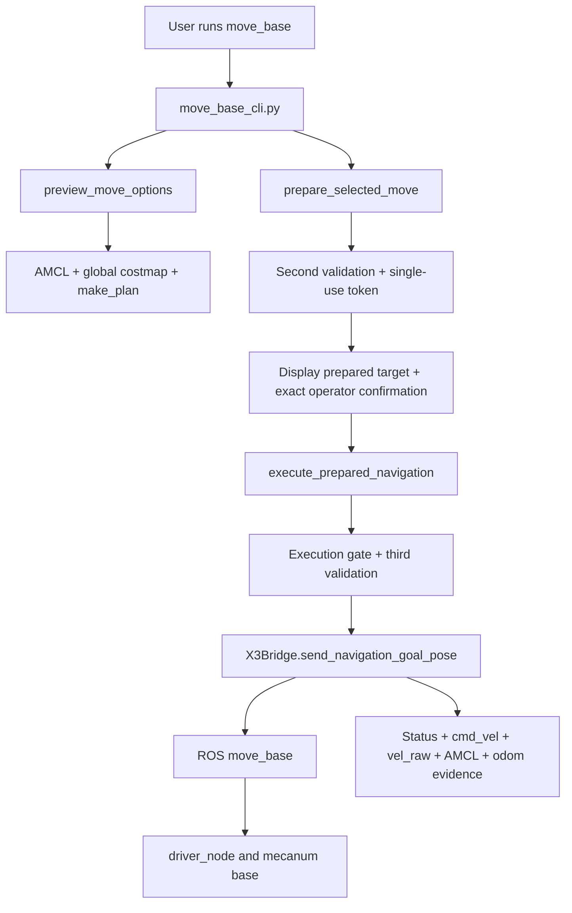

# Architecture

## Runtime environment

- Robot: Yahboom ROSMASTER X3 mecanum base
- Compute: Jetson TX2 NX
- OS: Ubuntu 18.04.6
- Navigation: ROS1 Melodic, AMCL, TF, global/local costmap, `move_base`
- Python boundary: ROS system Python is isolated from the Robonix Python 3.10 conda environment
- Bridge: rosbridge websocket and `roslibpy`

## Component flow

## Responsibilities

### `main.py`

- Maintains the Robonix primitive provider entry points.
- Generates bounded nearby candidates from server-controlled geometry.
- Applies localization, costmap, and path checks.
- Stores preview sessions and prepared-navigation tokens in process memory.
- Enforces single-use execution and third validation.
- Converts bridge observations into explicit success/failure results.

### `x3_bridge.py`

- Connects Python 3.10 to ROS1 through rosbridge.
- Reads pose, costmap, planner, status, velocity, and odometry data.
- Publishes a single `PoseStamped` navigation goal.
- Correlates the new goal ID and terminal move_base status.
- Cancels the associated goal on timeout or path-limit violation.
- Never publishes `/cmd_vel`.

### `move_base_cli.py`

- Provides the numbered candidate workflow.
- Normalizes Unicode and pasted terminal input.
- Requires exact confirmation only after displaying the prepared target.
- Leaves the execution gate closed on cancellation or mismatch.
- Opens the internal prepared-execution gate only around execution.
- Supports safe cancellation and prints structured evidence.

## Trust boundaries

The CLI is not trusted to choose arbitrary coordinates or relax thresholds. Candidate coordinates, confirmation text, token state, and validation parameters remain inside the provider process. The bridge is the only layer allowed to publish the ROS navigation goal, while ROS `move_base` remains the only expected `/cmd_vel` publisher.
